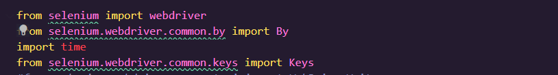
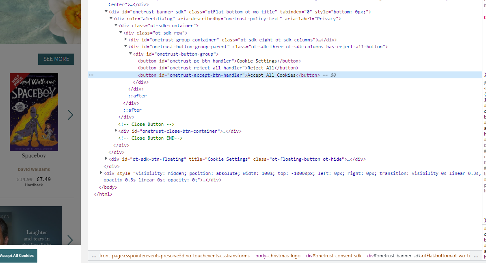
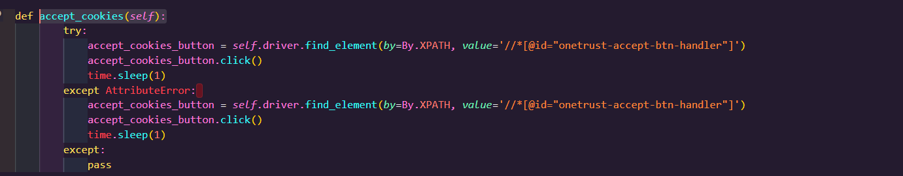
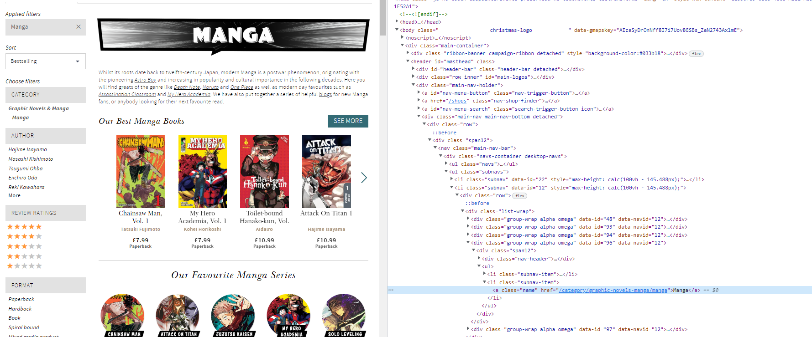
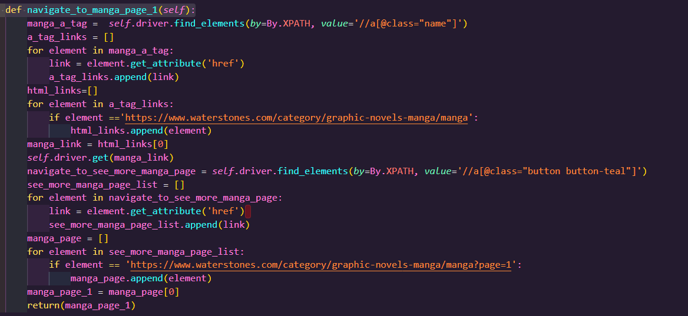
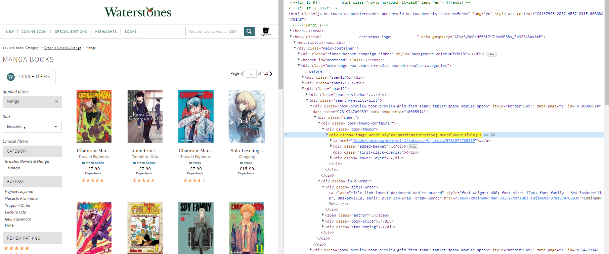
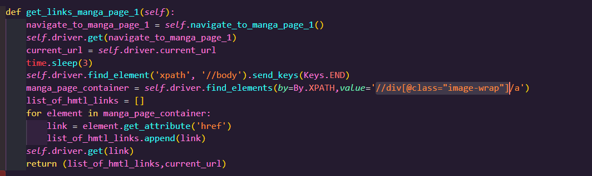
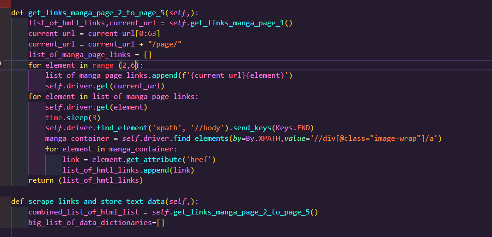

# data-collection-pipeline

This file contains the data collection pipeline project where the aim was to use selenium and python methods to scrape text and image data using html links of a chosen website and upload the data to the cloud. The first step was to choose a website to scrape. It was descided to scrape text and image data of books on www.waterstones.com/

Milstone 1 - Prototype finding the individual page for each entry

Setting up selenium

For the first method it was descided to first scrape text and image data from the manga section on waterstones. The first step was to import selenium by importing the selenium module. 

Class Waterstone scrapper.

A class was coded which would contain the various methods in order to scrape and store the required data was coded. The def __init__ method was created in order to initialize the first instance of the class. in order to use selenium to connect to a website the webdriver.Chrome() function was stored in the self.driver variable this was would allow selenium to connect to the google chrome browser. the self.driver.get() function was used to allow selenium to drive towards waterstone.com 

def accept_cookies() method:

Once selenium drives towards the waterstones homepage there is an accept_cookies button which needs to be clicked in order for the scrapping process to work. The accept_cookies method consists of the function to complete this tasks. the first step was to inspect html elements on the waterstones website by pressing ctrl+c to find the element path file of the accept cookies button. 

The relative xpath  was located and copy and pasted into the self.driver.find_element function which allows the driver to point to the element. the accept_cookies_button.click() method allows the webdrive to click on the accept cookies button on the waterstone website. The time.sleep method is coded after methods so that the webdriver will wait a couple of seconds, so that the website doesn't suspect the user is a bot.

def navigate_to_manga_page_1() method:

The purpose of this method is to navigate to manga section in waterstones and scrape the html links from the pages and store into a list to itterate through in order to scrape the required data. This is classified as a 'scrawler method.

This method is coded in order for the webdriver to navigate to the first page of the manga section books and store the various html links of each book on the first page. As with the accept cookies method the first step was to inspect the html elements on the waterstones website in order navigate to the manga section. 

on inspection the html elements were contained within a <a> tag which include a hyperlink reference 'href'. in order to store the hyperlink the relative xpath of the manga section page on waterstones were copined into the find_elements() method. The html elements within the manga section is located within the hmtl class='name' which is shared with the various other book catergories on the site. Therefore the once the find_elements method returns various web session links. in order to extract the hmtl links a for loop was coded which itterates through each web element and calls the get.attribute('href') method 
and is stored into a list. In order to extract the correct hmtl link used to navigate to the manga section an if statement is then written which states that of the hmtl  ink in the list is equal to the web link then the link should be stored in a list. The same  method is reported to navigate to the first page in the see more manga section and the html link a is returned in this method.

def get_links_manga_page_1() method.

The purpose of this method is to extract the hmtl links of the manga books on page 1 and store them within a list. The hmtl elements on page 1 were inspected to locate the html tags which store the href to each manga book on page 1. Once located the relative xpath was copied in the find_element() method

The method starts with the def navigate_to_manga_page_1() method is called which returns the html link of the manga section page 1 and the driver.get() method is called so the driver navigates to the first page. The find_elements() method is called to retrieve the web elements and then with a for loop the get_attribute('href') method is called to extract each html link on page 1 and this list along with the url to page 1 is returned. 

def get_links_manga_page_2_to_page_5() method.

In order to expand the data extracted for this project it was descided to also scrape data from pages 2 to page 5 in the see more manga section. The purpose of this method is to store the html links of the books from page 2 to page 5 and append to the list of the hmtl links extracted from page 1. The first step was to call the def get_links_manga_page_1() which returns the url of  see more mange seciton page 1. since the url for pages 2 to the page 5 are similar to page 1(minus the page number) The string of the url was adjusted to 'https://www.waterstones.com/category/graphic-novels-manga/manga/page' and a for loop was was coded to update the url with the page numbers from 2 to 5 and these urls were saved in a list. Then methods of extracting the html links of each manga book from pages 2 to page 5 are the same as the previous method and appended into the list of html links. This list now contains all the links of all the manga books from page 1 to page 5.

Milstone 2 -Setting up the virtual environment

In order to run the model a virtual environment with the correct installed libaries needed to be set up. The required libaries were opencv-python, tensorflow and ipykernel.

The conda create -n command was inputted into the bash terminal on VSCode to create the virtual environment and , conda pip install(pip install) commands were inputted to install the required libraries and its depedencies in the virtual environment.

pip list > requirments.txt and conda env export > env.yaml commands were inputted into the bash terminal to copy over the required libaries and dependencies. These file enables any other user that wants to use your computer to easily install these exact dependencies.

Milestone 3 - Create a Rock-Papper-Scissors game

The object of this Milestone is to create a python script that will simulate a Rock-Papper-Scissors game that will ask for a user input and then compare the user input against the computers choice to show the winner.

The first step was to write the import random module to pick a random option between rock, paper, and scissors and the input function to get the user's choice.

A get_user choice functions was written which will take in the users choice. The user choice input  was placed in a while loop which asks the user to enter either Rock,Papper or Scissors. If the user enters one of these options the users choice will be returned and stored as a string variable. The while loop will continue to run until the user input is correct.

A get_computer_choice function was written which will pick a random option from a list which contains strings called Rock,Paper,Scissors and return a choice and store as a string variable.

A get_winner function was written which will contain if-elif-else statements to descide the winner between the user and winner based on the classic rules of rock,paper,scissors. The arguments passed through the parameters of the get_winner function are the variables stored from the get_user_choice function and get_computer_choice function.

A play()  function was written which contains the get_user_choice, get_computer_choice and get_winner function.

Mileston 4 - Use the camera to play  Rock - Papper Scissors

The first step was to code import  the cV2 module from the keras_model. This will allow the capture frame which will take in the user input to pop up during each run. The import numpy as np and random were also written in order for the code to run.

get_prediction!
The output of the model is a list of probabilities for each class (Rock,Papper,Scissors,Nothing). A list labelled choices which contained the four classes was created. in order to choose the highest probability the prediction was stored in a highest index varible which contained the np.argmax function. The will pick the highest probability and was stored in in a user_choice variable. As each class corresponds to the corresponding value (e.g 0 - Rock) the user_choice variable contains the choices list which is indexed based on the highest_index. This will convert high probablity into the corresponding class.

get_computer_choice!

the get_computer_choice function was created to return the random computer choice using the choices variable. The computer choice variable is cantains the random.choice function with an index between [0:3]. This is to ensure the computer choice does not choose "Nothing" in the choices list.

get_winner!

the output from the get_prediction and get_computer_choice were returned and stored as user_choice and computer_choice variebles respectively and are passed as arguments within the parameter of the get_winner function. The get_winner function contains if,elif,else statements which descides the winner based classic Rock,Papper,Scissors. 

play_game!

A define play_game function was created to which will contain the main game loop. The main code from the model  was wrapped into this function and the corresponding functions mentioned above are called in the play_game function. Since the main code from the model is within a while loop the script reads the input from the camera and then compares it with the computer's choice without stopping. Therefore the time.time() function was stored within a  start_time variable which placed outside of the game while loop. a current time variable  which also  the time.time() function was placed within the game loop below the main code from the model. An elapsed time variable was created which is the difference between the start_time and current time. This allows for a countdown before the get_prediction function is called. A series of if,elif statements were created to ensure the the get_prediction and get_computer choise function is called after the countdown of 5 seconds. then between 5 and 7 seconds the get_winner function is called. After  7 seconds the start_variable is called again which resets the countdown. A series of true/false flages are placed within the code of the play_game function to ensure only one prediction is  sotred per itteration.

Class Computer_Vision!

In order to repeat the game until the user or computer wins 3 games, each win would need to be stored and itterated within a variable. In order to do this the functions for the game were wrapped in a class Computer_Vision. The def __init__ method was created in order to initialize the two parameters which are computer_wins and user_wins. The parameters store and itterate the user and computer score. A series of if,elif statments were created in the play_game function which control the user and computer points. If the return variable from the get_winner function is 'Computer wins' then the computer_wins variable is increased by 1 and vise versa for the user wins. An additional set of if,elif statments were created in the play_game function which return a statement on who wins the game if the computer_wins or user_wins reaches 3 points. This stops the while loop in the play_game function and ends the game.

Code improvements

in order to make the code readibility the class to initialize the class and function play_game call are wrapped in a def game loop function.

To make the script more usear friendly a additonal lines are written at the start of the code which explains to the user how to play the game. The user score and user score are also displayed throughout the game the so the user is aware.

