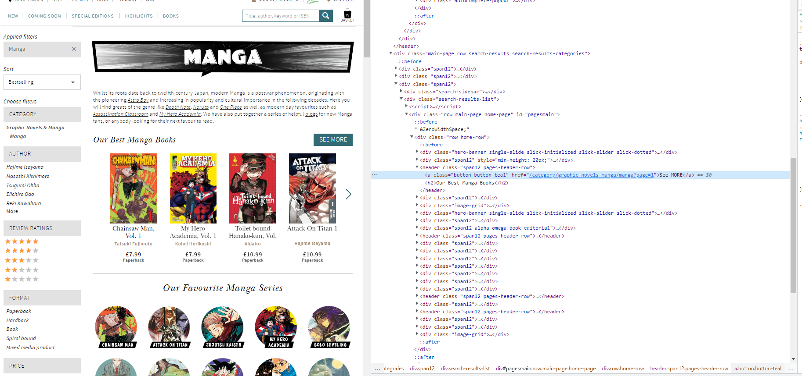

# data-collection-pipeline

This file contains the data collection pipeline project where the aim was to use selenium and python methods to scrape text and image data using html links of a chosen website and upload the data to the cloud. The first step was to choose a website to scrape. It was descided to scrape text and image data of books on www.waterstones.com/

Milstone 1 - Prototype finding the individual page for each entry

Setting up selenium

For the first method it was descided to first scrape text and image data from the manga section on waterstones. The first step was to import selenium by importing the selenium module. 

Class Waterstone scrapper.

A class was coded which would contain the various methods in order to scrape and store the required data was coded. The def __init__ method was created in order to initialize the first instance of the class. in order to use selenium to connect to a website the webdriver.Chrome() function was stored in the self.driver variable this was would allow selenium to connect to the google chrome browser. the self.driver.get() function was used to allow selenium to drive towards waterstone.com 

def accept_cookies() method:

Once selenium drives towards the waterstones homepage there is an accept_cookies button which needs to be clicked in order for the scrapping process to work. The accept_cookies method consists of the function to complete this tasks. the first step was to inspect html elements on the waterstones website by pressing ctrl+c to find the element path file of the accept cookies button. 

The relative xpath  was located and copy and pasted into the self.driver.find_element function which allows the driver to point to the element. the accept_cookies_button.click() method allows the webdrive to click on the accept cookies button on the waterstone website. The time.sleep method is coded after methods so that the webdriver will wait a couple of seconds, so that the website doesn't suspect the user is a bot.

def navigate_to_manga_page_1() method:

The purpose of this method is to navigate to manga section in waterstones and scrape the html links from the pages and store into a list to itterate through in order to scrape the required data. This is classified as a 'scrawler method.

This method is coded in order for the webdriver to navigate to the first page of the manga section books and store the various html links of each book on the first page. As with the accept cookies method the first step was to inspect the html elements on the waterstones website in order navigate to the manga section. 

on inspection the html elements were contained within a <a> tag which include a hyperlink reference 'href'. in order to store the hyperlink the relative xpath of the manga section page on waterstones were copined into the find_elements() method. The html elements within the manga section is located within the hmtl class='name' which is shared with the various other book catergories on the site. Therefore the once the find_elements method returns various web session links. in order to extract the hmtl links a for loop was coded which itterates through each web element and calls the get.attribute('href') method 
and is stored into a list. In order to extract the correct hmtl link used to navigate to the manga section an if statement is then written which states that of the hmtl  ink in the list is equal to the web link then the link should be stored in a list. The same  method is reported to navigate to the first page in the see more manga section and the html link a is returned in this method.

def get_links_manga_page_1() method.

The purpose of this method is to extract the hmtl links of the manga books on page 1 and store them within a list. The hmtl elements on page 1 were inspected to locate the html tags which store the href to each manga book on page 1. Once located the relative xpath was copied in the find_element() method

The method starts with the def navigate_to_manga_page_1() method is called which returns the html link of the manga section page 1 and the driver.get() method is called so the driver navigates to the first page. The find_elements() method is called to retrieve the web elements and then with a for loop the get_attribute('href') method is called to extract each html link on page 1 and this list along with the url to page 1 is returned. 

def get_links_manga_page_2_to_page_5() method.

In order to expand the data extracted for this project it was descided to also scrape data from pages 2 to page 5 in the see more manga section. The purpose of this method is to store the html links of the books from page 2 to page 5 and append to the list of the hmtl links extracted from page 1. The first step was to call the def get_links_manga_page_1() which returns the url of  see more mange seciton page 1. since the url for pages 2 to the page 5 are similar to page 1(minus the page number) The string of the url was adjusted to 'https://www.waterstones.com/category/graphic-novels-manga/manga/page' and a for loop was was coded to update the url with the page numbers from 2 to 5 and these urls were saved in a list. Then methods of extracting the html links of each manga book from pages 2 to page 5 are the same as the previous method and appended into the list of html links. This list now contains all the links of all the manga books from page 1 to page 5.

def scrapper_method().

This method was coded to contain the methods coded for milestone 1.This method is then called in a if __name__ == "__main__" block.

Milestone 2 - Retrieve data from details page

def create_directory()

The purpose of this method is to create a folder directory to store the images scrapped from each book link and the text data (done by importing the import os module).

def scrape_links_and_store_text_image_data()

text data
The purpose of this method is to scrape each book and store within a dictionary and to store the image of each book and store within a folder. As with the methods mentioed in milestone 1 the first step was to inspect the html elements to each link to find the xpath of  the relevent data and copy into the find.element method. The data scraped included the each books ISBN number, author, book format, price and other information. A for loop was coded in order access the each manga book link, find each element for the corresponding  text data and store within a dictionary and then append each dictionary to a list. along with the this data each book was assigned a unique id number (generated by importing the from uuid import uuid4 and calling the str(uuid4()) method), this id number would also be used to label each book image along with a timestap (generated by importing the import time
from datetime import datetime and calling the datetime.now() and time.strftime("%Y-%m-%d") methods)

image data

As mentioned above this method also finds the html element of each book elment and calls the get_attrinute('src') method to retrieve the src link for each image and then the requests.get().content method to retrieve the contents of each image(bytes). A contet manger is coded in order to upload load each book image into the corresponding file. 

This method returns the list which contains the dictionaries of text data for each book.

def save_raw_dictionaries() method

This method calls the scrape_links_and_store_text_image_data() method and passes the list which contains the dictionaries of text data for each book and implements a content manager to store the data as a json file.

