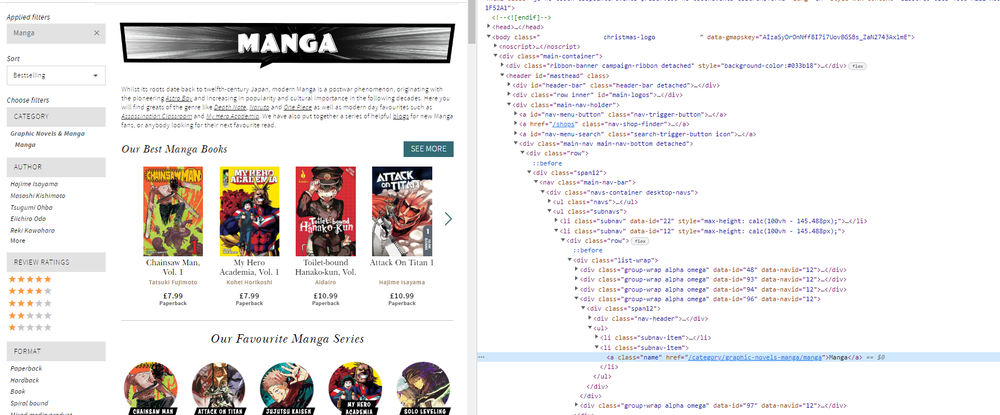
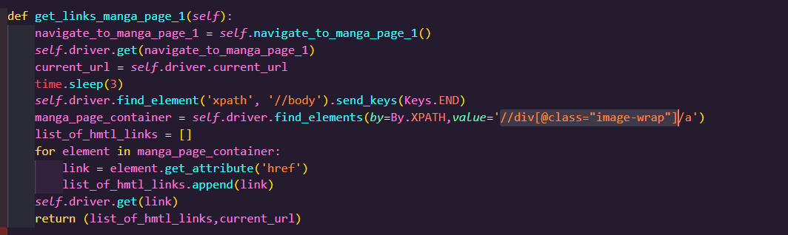
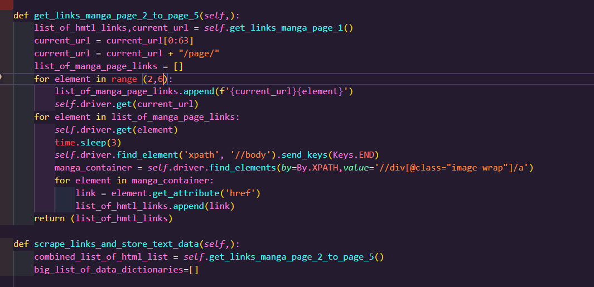

## Data Collection Pipeline Project
&nbsp;

The aim of this project was to utilise selenium webdriver and python methods to scrape text and image data from web html links of a chosen website and upload the methods and associated data onto docker. The first step was to choose a website to scrape. It was descided to scrape text and image data of manga books on www.waterstones.com/  
&nbsp;

## Milestone 1 - Prototype finding the individual page for each entry 
&nbsp;

__Setting up selenium__ 

The first step was to install chromedriver to google chrome. The chromedriver was sent to the relevent python path and selenium was installed using the pip install selenium code. Now the selenium module could be imported into the python script.
&nbsp;

*Figure 1 - selenium import in python*

&nbsp;

__Class WaterstonesScrapper.__

A class was coded which would contain the various methods in order to scrape and store the required data. The def __init__ method was created in order to initialize the first instance of the class. in order to use selenium to connect to a website the webdriver.Chrome() function was stored in the self.driver variable this was would allow selenium to connect to the google chrome browser. the self.driver.get() function was used to allow selenium to drive towards waterstone.com 

&nbsp;

__accept_cookies() method:__

Once selenium drives towards the waterstones homepage there is an accept_cookies button which needs to be clicked on in order for the scrapping process to work. The __accept_cookies method__ consists of the code  to complete this task. the first step was to inspec the html elements on the waterstones website by pressing ctrl+c to find the element path file of the accept cookies button. 

&nbsp;

*Figure 2 - html path of the accept cookies button*

 &nbsp;

The relative xpath was located and copy and pasted into the self.driver.find_element function which allows the driver to point to the element. The accept_cookies_button.click() method allows the webdriver to click on the accept cookies button on the waterstone website. The time.sleep method is coded after so that the webdriver will wait a couple of seconds, and the website doesn't suspect the user is a bot.

*Figure 3 - accept cookies button method*

&nbsp;

__navigate_to_manga_page_1 method__

This method is coded in order for the webdriver to navigate to the first page of the see more manga section. As with the accept cookies method the first step was to inspect the html elements in order to complete this task. 

&nbsp;

*Figure 4 - manga section from page html elements*

&nbsp;

On inspection the html elements were contained within a tag which include a hyperlink reference 'href'. The html elements within the first page of the see more manga section were located within the hmtl class='name' hence in order to store the hyperlinks the relative xpath were placed into the __find_elements method__ which returns the various web session links. in order to extract the hmtl links a for loop was coded which iterates through each web element and calls the __get.attribute('href') method__.   
&nbsp;

Each link was stored into a list. An if statement is coded in order to extract the correct html link from the web elements and is returned in the method in string format.

&nbsp;

*Figure 5 - navigate_to_manga_page_1 method*

&nbsp;

__get_links_manga_page_1 method__
&nbsp;

The purpose of this method is to extract the hmtl links of each manga books on page 1 and store them within a list. The hmtl elements on page 1 were inspected to locate the html tags which store the href to each manga book on page 1. Once located the relative xpath was copied ito the __find_elements method__.

&nbsp;

*Figure 6 - html elements on page 1*
&nbsp;

The method calls the __navigate_to_manga_page_1__ method which returns the html link of the  see more manga section page 1 and the __driver.get method__ is called so that the webdriver navigates to the first page. The __find_elements method__ is called to retrieve the web elements and then a for loop is coded  where the __get.attribute('href') method__ is called to extract the html link for each book on page 1 and  is appended to a list. The list along with the current url to page 1 is returned in a tupple format.

&nbsp;

*Figure 7 - get_links_manga_page_1 method*

&nbsp;

__get_links_manga_page_2_to_page_5 method__

&nbsp;

In order to expand the data extracted for this project it was decided to also scrape data from pages 2 to page 5 in the see more manga section. The purpose of this method is to store the html links of the books from page 2 to page 5 and append to the list of the hmtl links extracted from page 1. The first step was to call the __get_links_manga_page_1__ method which returns the url of  see more mange seciton page 1

&nbsp;

On inspection the url for pages 2 to the page 5 were similar to page 1 (minus the page number) therefore The string of the url was adjusted to 'https://www.waterstones.com/category/graphic-novels-manga/manga/page' and a for loop was was coded to update the url with the page numbers from 2 to 5 and these urls were saved in a list. The same methods to extract the html links were coded and html links were appended to the  list which contains the html links from page 1.

*Figure 8 - get_links_manga_page_2_to_page_5 method*

__scrapper  method__ 

This method contain the methods coded for milestone 1. This method is then called in a if __name__ == "__main__"  block.

## Milestone 2 - Retrieve data from details page
&nbsp;

__create_directory method__

In order to save scraped data the method was coded which creates a folder directory to save the images scrapped from each book and the corresponding text data. This by importing os and applying the __os.path.join method__.

*Figure 9 - create_directory method*

&nbsp;

__scrape_links_and_store_text_image_data method__

__text data__
&nbsp;

The purpose of this method is to scrape text data for each book and store within a dictionary and to store each image within a folder. As with the methods mentioed in milestone 1 the first step was to inspect the html elements to each link to find the xpath of the relevent data and place into the __find_elements method__.  The text data included each books ISBN number, author, book format, and other information. A for loop was coded in order access the each manga book link, find each element for the corresponding text data and store within a dictionary and then append each dictionary to a list. 

&nbsp;

*Figure 10 - scrapping and saving text data*

Each book was assigned a unique id number (generated by importing the from uuid import uuid4 and calling the __str(uuid4()) method__), this id number would also be used to label each book image along with a timestap (generated by importing the import time
from datetime import datetime and calling the __datetime.now()__ and __time.strftime("%Y-%m-%d")__ methods).

__image data__
&nbsp;

the method also finds the html element of each book elment and calls the __get_attrinute('src') method__ to retrieve the src link for each image and then the __requests.get().content method__ to retrieve the contents of each image(bytes). A contet manger is coded in order to upload load each book image into the corresponding file. This method returns the list which contains the dictionaries of the text data for each book.

&nbsp;

*Figure 11 - scrapping and saving image data*

&nbsp;

## Milestone 3 - Documentation and testing

&nbsp;

__Refactoring__

The first step was to review and refractor the code written in milestone 2. This included;

* Renaming methods so that they are clear and concise to any who reads the code.
* Ensuring that the appropiate methods were made private.
* Re-ordering the sequence of the imports required for the code to run in alphabetical order.
* Adding docs to methods.

 These improvements made the code look clearer and more user friendly.

&nbsp;

__unit testing__

The second step was to set up unit tests for each public method. This was done by creating a test.py file which contains __class producttestcase__ to test each method. The purpose of each test is to ensure each public method is returning the expected data type (string,list,dictionary). This is to ensure that the code is processing the correct data as expected. Each unit test passes for each method.

__Project management__

The last step was to organise and add the relevent files which will ensure the code is packages correctly. This included adding;

* renaming the python script as 'WaterstonesScrapper.py' and placing the script into a project folder.
* placing the test file into a test folder.
* creating a requirements.txt file which contains the external dependencies and versions.
* Creating a setup.py and setup.cfg which contains the meta data of the project and packages which need to be installed.
* Creating README.md file 
* Creating a liscence file which describes the liscence of the project.
* Creating a gitignore file.

## Milestone 4 - Containerising the scraper

&nbsp;

__Headless mode__

After confirming the unit tests still run, the next step was to run the scraper file in headless mode without the GUI. This was done so that the script could be run correctly in docker. The correct  __options arguments__ were coded into the __init method__ to allow the headless mode to work.

*Figure 11 - Options arguments*

&nbsp;

__Docker image__

In order to build the docker image a docker file which contains the instructions on how to build the image was first created. in order to build images a docker acount was first created and docker desktop app was downloaded.

The docker file contains the following;

* From - The base image for the docker image(python).
* Copy - Copies everything in the docker file directory (requirments.txt, scraper folder) into the container
* Run -  Installs the required dependencies for the script to run. 
* CMD - Specifies the instruction that is to be executed when a Docker container starts.

&nbsp;

*Figure 12 - Dockerfile*

&nbsp;

The next step was to build the image using the docker build command.

&nbsp;

__Docker container__

&nbsp;

Now that the docker image was built the next step was to run the docker container using the docker run command. The script within the container ran fine with no issues. The container was then pushed onto docker hub.

&nbsp;

## Milestone 5 - Set up a CI/CD pipeline for your docker image

&nbsp;

in order to fully automate the docker image build and container run, it was first required to set up Github actions on the repository. 

__Create repository__
&nbsp;

The first step was to got the actions section in the repository on github and create two GitHub secrets actions. 

The first was a secret is called DOCKER_HUB_USERNAME which contained the name of the dockerhub account created and the seccond is called OCKER_HUB_ACCESS_TOKEN which contained a Personal Access Token (PAT) genetated on dockerhub.

__Set up the workflow__
&nbsp;

The next step was Set up the GitHub Actions workflow for building and pushing the image to Docker Hub. This was done by going to actions section on the repo and selecting set up workflow which creates a Github actions work file contained in yaml format.

&nbsp;

__Define the workflow steps__
&nbsp;

The step included setting up the build context within the yaml file. The contains all the information for docker hub to copy to files mentioned in the dockerfile then build an image and automatically push to docker hub.

The last step was to commit the changes in the repo which would automatically start workflow. In order to make sure the workflow worked flow the image pushed on to docker hub was downloaded and a container was created and run to ensure the script ran correctly.